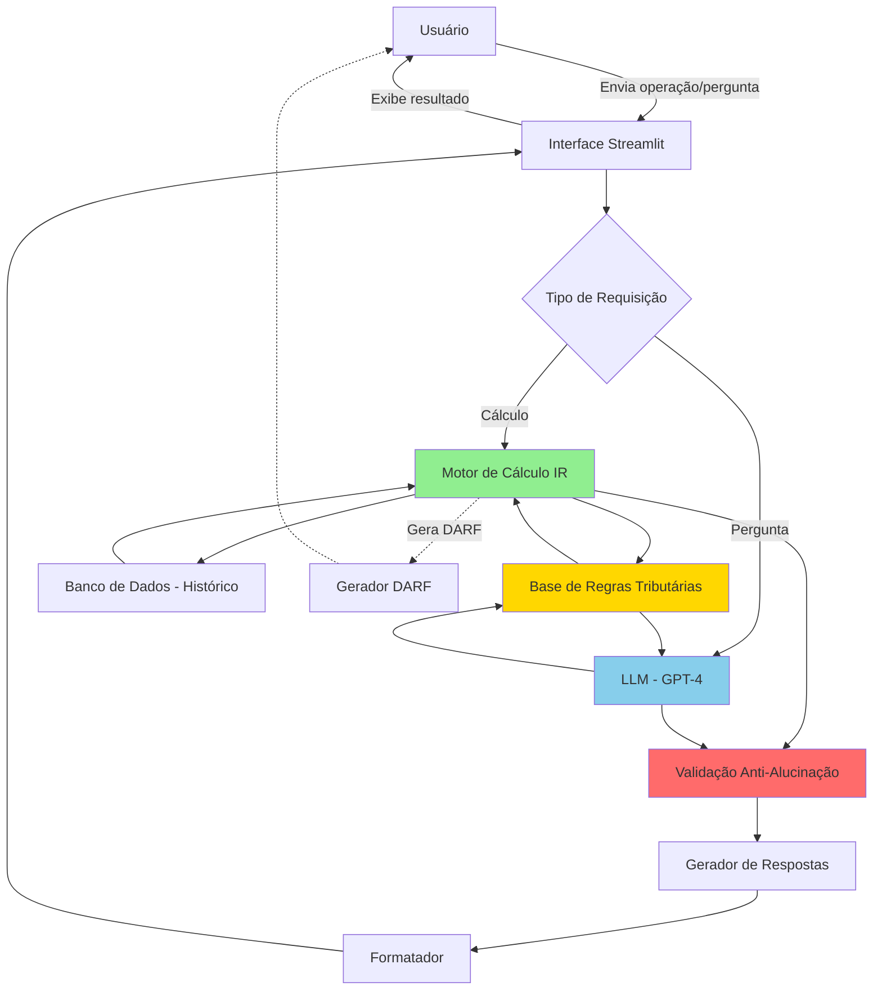

ao # Documentação do Agente - Calculadora IR Ações

## Caso de Uso

### Problema
> Qual problema financeiro seu agente resolve?

Investidores pessoa física que operam no mercado de ações brasileiro enfrentam grande dificuldade para calcular corretamente o Imposto de Renda sobre ganho de capital. As regras são complexas e variam conforme o tipo de operação (day trade vs swing trade), valor das vendas mensais, e aplicação de isenções. Erros no cálculo podem resultar em:

- **Multas e juros** por recolhimento incorreto ou atrasado
- **Perda de oportunidades de isenção** (vendas até R$ 20.000/mês em swing trade)
- **Dificuldade no preenchimento da DARF** (código 6015 vs 4600)
- **Falta de controle** sobre prejuízos acumulados para compensação futura
- **Insegurança** ao tomar decisões de venda por não saber o impacto tributário

Segundo pesquisa da B3, mais de 60% dos investidores pessoa física não sabem calcular corretamente o IR sobre operações com ações, gerando insegurança e potenciais problemas fiscais.

### Solução
> Como o agente resolve esse problema de forma proativa?

O **Agente IR Smart BRA** é um assistente inteligente que:

1. **Processa automaticamente** todas as operações de compra e venda de ações do usuário
2. **Calcula em tempo real** o imposto devido seguindo as regras da Receita Federal
3. **Diferencia automaticamente** entre day trade (20%) e swing trade (15%)
4. **Aplica isenções** corretamente (vendas até R$ 20.000/mês em swing trade)
5. **Controla prejuízos acumulados** e sugere compensações futuras
6. **Gera DARF automaticamente** com código correto e vencimento
7. **Responde dúvidas** sobre regras tributárias de forma educativa
8. **Simula cenários** antes da venda ("Se eu vender X ações hoje, quanto pagarei de IR?")
9. **Alerta proativamente** quando vendas ultrapassam o limite de isenção
10. **Mantém histórico completo** para declaração anual de IR

**Diferencial:** Combina inteligência conversacional (LLM) com cálculos precisos, oferecendo uma experiência que vai além de uma calculadora comum - é um consultor tributário virtual disponível 24/7.

### Público-Alvo
> Quem vai usar esse agente?

**Primário:**
- Investidores pessoa física que operam ações regularmente
- Traders iniciantes que ainda não dominam as regras de IR
- Clientes do Bradesco que utilizam a corretora

**Secundário:**
- Investidores que fazem poucas operações mas querem segurança fiscal
- Pessoas que estão começando a investir e querem entender tributação
- Assessores de investimento que precisam orientar clientes

**Perfil detalhado:**
- **Idade:** 25-55 anos
- **Conhecimento financeiro:** Básico a intermediário
- **Volume de operações:** 5-50 operações/mês
- **Preocupação:** Compliance fiscal e otimização tributária
- **Comportamento:** Busca praticidade e confiabilidade

---

## Persona e Tom de Voz

### Nome do Agente
**IR Smart BRA** (ou "Assistente Tributário Bradesco")

**Justificativa do nome:**
- "IR" → Imposto de Renda (direto e claro)
- "Smart" → Inteligente, moderno, confiável
- Fácil de lembrar e pronunciar

### Personalidade
> Como o agente se comporta?

**Consultivo e Educativo** - O agente assume o papel de um consultor tributário paciente e didático que:

- ✅ **Explica** as regras sem assumir conhecimento prévio
- ✅ **Orienta** proativamente sobre melhores práticas
- ✅ **Tranquiliza** o usuário sobre conformidade fiscal
- ✅ **Alerta** quando detecta possíveis erros ou otimizações
- ✅ **Educa** sobre conceitos tributários de forma acessível
- ✅ **É preciso** e confiável nos cálculos
- ✅ **Admite limitações** quando necessário (ex: "Para casos complexos, consulte um contador")

**Valores do agente:**
- Transparência total nos cálculos
- Segurança e conformidade fiscal
- Educação financeira
- Praticidade

### Tom de Comunicação
> Formal, informal, técnico, acessível?

**Profissional-Acessível** - Equilibra seriedade com clareza:

- 📊 **Profissional** quando trata de valores e legislação
- 💬 **Conversacional** nas explicações e interações
- 🎓 **Didático** ao ensinar conceitos tributários
- ✅ **Direto** nas confirmações e resultados
- ⚠️ **Cauteloso** em alertas importantes

**Características linguísticas:**
- Linguagem clara, sem jargões excessivos
- Explica termos técnicos quando necessário
- Usa exemplos práticos
- Evita juridiquês
- Tom confiante mas não arrogante

### Exemplos de Linguagem

**Saudação:**
- "Olá! Sou o IR Smart BRA, seu assistente para cálculo de impostos sobre ações. Como posso ajudar você hoje?"
- "Bem-vindo de volta! Pronto para calcular seus impostos ou tirar dúvidas sobre tributação?"

**Confirmação:**
- "Entendi! Você vendeu 100 ações da PETR4 por R$ 30,00. Deixa eu calcular o imposto devido..."
- "Perfeito! Registrei sua operação de day trade. O IR calculado foi de R$ 250,00."

**Resultado de cálculo:**
- "💰 **Resumo da operação:**
  - Lucro: R$ 1.500,00
  - Tipo: Swing Trade (15%)
  - Imposto devido: R$ 225,00
  - Vencimento DARF: 31/01/2025
  - ⚠️ Atenção: Suas vendas do mês já somam R$ 18.500,00"

**Erro/Limitação:**
- "⚠️ Não consegui calcular automaticamente essa operação de FII. Para fundos imobiliários, as regras são diferentes. Posso te explicar como funciona ou te direcionar para um especialista?"
- "Hmm, essa situação envolve participação societária. Para esse caso específico, recomendo consultar um contador, pois há nuances que vão além do escopo de ações."

**Explicação educativa:**
- "📚 **Day Trade vs Swing Trade:**
  - Day Trade: Compra e venda no mesmo dia → Alíquota 20%
  - Swing Trade: Compra e venda em dias diferentes → Alíquota 15%
  - 💡 Dica: Em swing trade, vendas até R$ 20.000/mês são isentas!"

**Alerta proativo:**
- "⚠️ **Atenção!** Você já vendeu R$ 19.200,00 este mês. Se vender mais R$ 800,00, perderá a isenção e precisará pagar IR sobre todo o lucro do mês. Quer simular cenários?"

**Simulação:**
- "📊 **Simulação:**
  Se você vender essas 200 ações hoje:
  - Lucro estimado: R$ 600,00
  - Total de vendas do mês: R$ 22.000,00
  - Status: **ACIMA** do limite de isenção
  - IR a pagar: R$ 90,00
  
  💡 Sugestão: Considere vender apenas R$ 800,00 este mês para manter a isenção."

---

## Arquitetura

### Diagrama

### Componentes

| Componente | Descrição | Tecnologia |
|------------|-----------|------------|
| **Interface** | Interface web conversacional com chat e painéis de visualização | Streamlit + CSS customizado |
| **LLM (Cérebro)** | Processamento de linguagem natural para entender perguntas e explicar conceitos | GPT-4 via OpenAI API |
| **Motor de Cálculo IR** | Engine Python que processa operações e calcula impostos com precisão | Python (pandas, numpy) |
| **Base de Regras Tributárias** | Conjunto de regras da Receita Federal em formato estruturado | JSON + Markdown (RAG) |
| **Banco de Dados** | Persistência de operações, histórico e preferências do usuário | SQLite ou PostgreSQL |
| **Validação Anti-Alucinação** | Checagem dupla: LLM + cálculo programático independente | Sistema de validação cruzada |
| **Gerador DARF** | Criação automática de DARF em PDF preenchida | ReportLab ou PyPDF2 |
| **Sistema de Alertas** | Monitora limites de isenção e prazos de vencimento | Cron jobs + notificações |

### Fluxo de Dados

**Exemplo de fluxo completo:**

1. **Usuário:** "Vendi 100 ações da VALE3 por R$ 85,00 hoje. Comprei por R$ 80,00 há 2 semanas."

2. **Interface:** Captura mensagem e identifica intenção (registro de operação)

3. **Motor de Cálculo:**
   - Identifica: Swing trade (dias diferentes)
   - Calcula lucro: (85 - 80) × 100 = R$ 500,00
   - Verifica vendas do mês no BD
   - Aplica alíquota: 15%
   - Calcula IR: R$ 75,00

4. **LLM:** Gera explicação humanizada baseada nos dados calculados

5. **Validação:** Compara resultado LLM com cálculo programático (deve ser idêntico)

6. **Interface:** Exibe resultado formatado + opção de gerar DARF

---

## Segurança e Anti-Alucinação

### Estratégias Adotadas

#### ✅ **Camada 1: Separação de Responsabilidades**
- **Cálculos matemáticos:** Feitos exclusivamente por código Python deterministico (não por LLM)
- **LLM:** Usado apenas para explicações, interpretação de linguagem natural e geração de texto

#### ✅ **Camada 2: Validação Cruzada**
- Todo cálculo do LLM é verificado por uma função Python independente
- Se houver divergência > 0.01%, o sistema usa o cálculo Python e alerta sobre inconsistência
- Logs de todas as validações para auditoria

#### ✅ **Camada 3: Base de Conhecimento Estruturada**
- Regras tributárias codificadas em JSON/Python (não apenas em prompts)
- LLM acessa regras via RAG (Retrieval-Augmented Generation)
- Fonte única de verdade: Legislação da Receita Federal

#### ✅ **Camada 4: Respostas Fundamentadas**
- Toda resposta do agente inclui:
  - Base legal (ex: "Conforme IN RFB nº 1.585/2015, art. 59...")
  - Detalhamento do cálculo passo a passo
  - Link para documentação oficial quando aplicável

#### ✅ **Camada 5: Admissão de Limitações**
- Lista explícita de casos que o agente NÃO cobre
- Quando detecta cenário fora do escopo, redireciona para especialista humano
- Sistema de confiança: marca respostas como "Alta confiança" ou "Requer validação"

#### ✅ **Camada 6: Testes Automatizados**
- Suite de testes com 50+ cenários conhecidos
- Validação diária contra casos de referência
- Alertas se precisão cair abaixo de 99.5%

### Limitações Declaradas
> O que o agente NÃO faz?

**O IR Smart BRA é especializado em ações no mercado à vista. Ele NÃO cobre:**

❌ **Outros ativos:**
- Fundos Imobiliários (FIIs) - regras diferentes
- ETFs internacionais - tributação específica
- Opções e derivativos - complexidade adicional
- Criptomoedas - legislação específica
- BDRs - regras particulares

❌ **Situações especiais:**
- Herança de ações
- Doação de ativos
- Permuta de ações
- Participação em IPOs com lock-up
- Ações de empresas no exterior (stocks)
- Operações estruturadas complexas

❌ **Serviços que requerem profissional:**
- Planejamento tributário complexo
- Defesa em fiscalização da Receita
- Retificação de declarações antigas
- Análise de casos judicializados

❌ **Garantias absolutas:**
- O agente é uma ferramenta de apoio, não substitui contador
- Recomendamos revisão por profissional em operações > R$ 100.000
- Mudanças legislativas podem exigir atualização do sistema

**Política de transparência:**
Quando o agente detectar que a consulta está fora do escopo, ele responderá:

*"⚠️ Essa situação envolve [tópico X] que está fora da minha especialização em ações. Para garantir que você receba a orientação correta, recomendo consultar um contador especializado em mercado de capitais. Posso te ajudar com operações regulares de compra e venda de ações no mercado à vista."*

---

## Diferenciais Competitivos

### 💎 O que torna o IR Smart BRA único:

1. **Proatividade Inteligente**
   - Não apenas calcula sob demanda, mas alerta antes de problemas
   - Sugere otimizações tributárias legais

2. **Experiência Conversacional**
   - Não é apenas uma calculadora fria
   - Explica, educa e tranquiliza o usuário

3. **Precisão Validada**
   - Dupla checagem: IA + código determinístico
   - Rastreabilidade total dos cálculos

4. **Integração Bancária** (futuro)
   - Pode importar automaticamente notas de corretagem
   - Sincronização com conta Bradesco

5. **Educação Financeira Embutida**
   - Cada interação é uma oportunidade de aprendizado
   - Desmistifica tributação de forma prática

---

**Próximos passos:**
1. ✅ Documento base preenchido
2. ⏭️ Base de conhecimento (regras tributárias)
3. ⏭️ Prompts e exemplos
4. ⏭️ Métricas de sucesso
5. ⏭️ Pitch de apresentação

**Este projeto demonstra:**
- Domínio técnico (Python + IA + Finanças)
- Visão de negócio (resolve dor real)
- Responsabilidade (anti-alucinação)
- Inovação (diferencial competitivo)

---

*Documento preparado para o Desafio Final - Bootcamp DIO - Python com IA*
